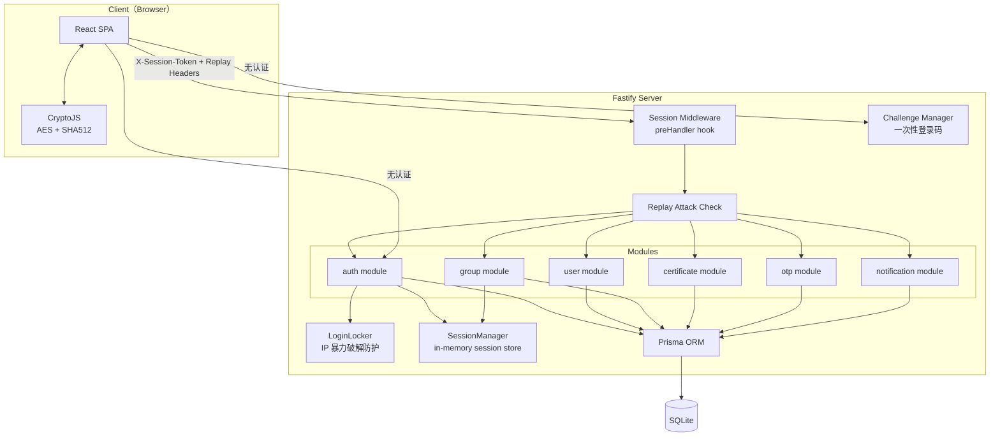
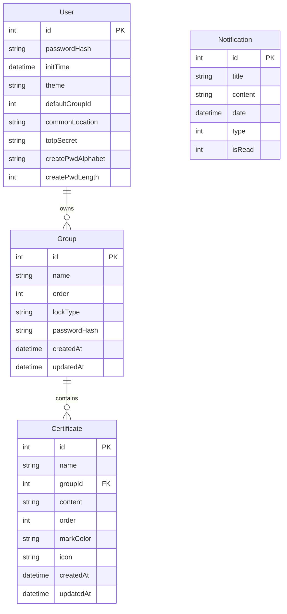
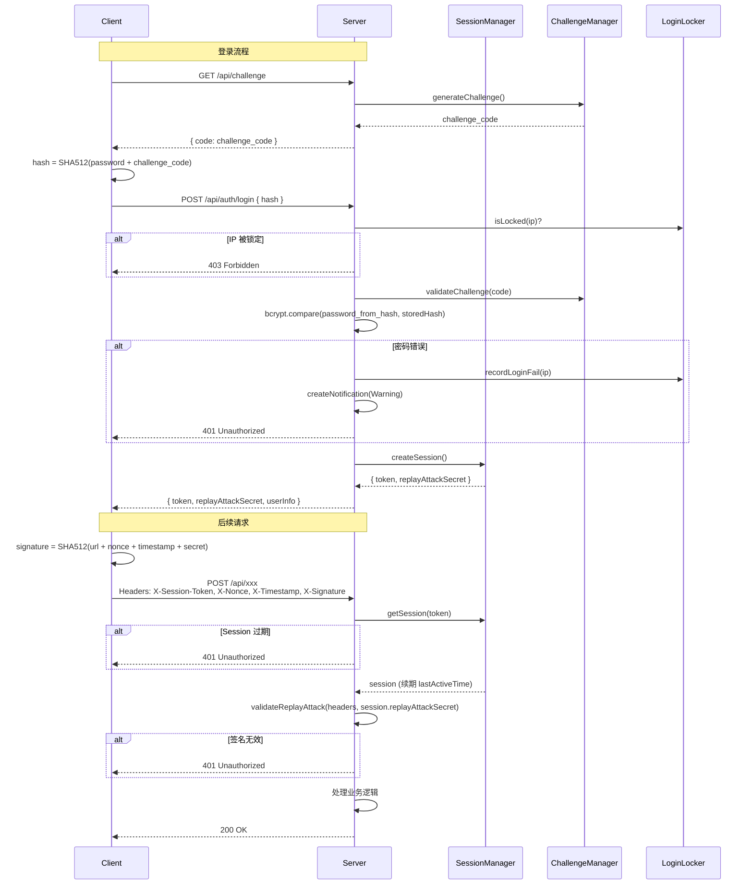

# 密码管理器迁移 - Design

> **Status**: Draft
> **Requirements**: [requirements.md](./requirements.md)
> **Last Updated**: 2026-03-06

## Overview

基于 Fastify 5 + Prisma + TypeBox 新架构，将 cube-password-old 的密码管理业务以模块化方式重建。认证采用 Session-based 方案（替代 JWT），保留旧项目全部安全特性。

---

## Architecture Overview



---

## Component Design

### SessionManager（新增）

**文件**: `packages/backend/src/lib/session/index.ts`

**Purpose**: 替代 @fastify/jwt，提供 session-based 认证。单用户场景，内存中仅维护一个活跃 session。

**接口**:

```typescript
interface UserSession {
  token: string; // nanoid 生成的 session token
  replayAttackSecret: string; // 每次登录重新生成
  unlockedGroupIds: Set<number>; // 当前已解锁的分组
  lastActiveTime: number; // 上次活动时间戳
}

interface SessionManager {
  createSession(): UserSession; // 登录时创建
  getSession(token: string): UserSession | null; // 验证 + 续期
  destroySession(): void; // 登出时销毁
  addUnlockedGroup(groupId: number): void;
  isGroupUnlocked(groupId: number): boolean;
}
```

**行为**:

- `getSession()` 检查 `lastActiveTime`，超过 30 分钟返回 null 并自动清除
- `getSession()` 成功时自动更新 `lastActiveTime`（续期）
- `createSession()` 会先 `destroySession()`（单用户单 session）
- 服务重启后 session 自然丢失，用户需重新登录

### ChallengeManager（新增）

**文件**: `packages/backend/src/lib/challenge/index.ts`

**Purpose**: 管理一次性 challenge code，用于登录时防止密码明文传输。

```typescript
interface ChallengeManager {
  generateChallenge(): string; // 生成 challenge（nanoid），存入内存，5 分钟过期
  validateChallenge(code: string): boolean; // 验证并消费（一次性）
}
```

### LoginLocker（新增）

**文件**: `packages/backend/src/lib/login-locker/index.ts`

**Purpose**: IP 级暴力破解防护。

```typescript
interface LoginLocker {
  recordLoginFail(ip: string): void; // 记录失败
  isLocked(ip: string): boolean; // 检查是否被锁定
  getFailCount(ip: string): number; // 获取当日失败次数
}
```

**行为**:

- 每 IP 每日最多 3 次失败，超过后锁定至次日
- 使用 `dayjs` 按自然日划分计数周期

### IpLocation（新增）

**文件**: `packages/backend/src/lib/ip-location/index.ts`

**Purpose**: 本地离线 IP 地理位置查询，用于异常登录检测。

```typescript
interface IpLocation {
  queryIp(ip: string): Promise<string>; // 返回 "国家|区域|省份|城市|服务提供商"
}

// 工具函数
function isSameLocation(loc1: string, loc2: string): boolean; // 比较两个位置是否同一区域
function formatLocation(location: string): string; // 格式化为可读字符串
```

**实现**:

- 移植旧项目的 `ip2region.ts` + `queryIp.ts`
- 使用 `ip2region.xdb` 本地数据文件（放在 `packages/backend/storage/` 下）
- 通过 vectorIndex 模式加载，查询性能优秀（<1ms）

### Auth 模块（改造）

**替换现有 JWT 认证**，改为 session-based。

**Controller**: `modules/auth/controller.ts`

| 接口                             | 认证                   | 说明                    |
| -------------------------------- | ---------------------- | ----------------------- |
| `GET /api/challenge`             | 无                     | 返回 challenge code     |
| `GET /api/global`                | 无                     | 返回全局配置            |
| `POST /api/auth/init`            | 无                     | 初始化用户（仅限首次）  |
| `POST /api/auth/login`           | 无（LoginLocker 检查） | 验证密码 → 创建 session |
| `POST /api/auth/logout`          | session                | 销毁 session            |
| `POST /api/auth/change-password` | session                | 修改密码 → 销毁 session |

**Service**: `modules/auth/service.ts`

```typescript
interface AuthServiceDeps {
  prisma: PrismaService;
  sessionManager: SessionManager;
  challengeManager: ChallengeManager;
  loginLocker: LoginLocker;
  ipLocation: IpLocation; // IP 地理位置查询
  notificationService: NotificationService; // 登录失败时写通知
}
```

### User 模块（新增）

**Controller**: `modules/user/controller.ts`

| 接口                                | 说明                   |
| ----------------------------------- | ---------------------- |
| `POST /api/user/set-theme`          | 设置主题（light/dark） |
| `POST /api/user/statistic`          | 返回分组数 + 凭证数    |
| `POST /api/user/create-pwd-setting` | 更新密码生成器配置     |

**Service**: `modules/user/service.ts`

```typescript
interface UserServiceDeps {
  prisma: PrismaService;
}
```

### Certificate 模块（新增）

**Controller**: `modules/certificate/controller.ts`

| 接口                           | 说明                             |
| ------------------------------ | -------------------------------- |
| `POST /api/certificate/add`    | 创建凭证                         |
| `POST /api/certificate/detail` | 获取凭证详情                     |
| `POST /api/certificate/update` | 更新凭证                         |
| `POST /api/certificate/delete` | 批量删除                         |
| `POST /api/certificate/move`   | 移动分组                         |
| `POST /api/certificate/sort`   | 更新排序                         |
| `POST /api/certificate/search` | 搜索（关键字 + 颜色 + 日期范围） |

**Service**: `modules/certificate/service.ts`

```typescript
interface CertificateServiceDeps {
  prisma: PrismaService;
  sessionManager: SessionManager; // 检查分组是否已解锁
}
```

**搜索逻辑**：Prisma `where` 组合 `contains`（关键字）+ `equals`（颜色）+ `gte/lte`（日期），支持分页（skip/take）。

### Group 模块（新增）

**Controller**: `modules/group/controller.ts`

| 接口                            | 说明                   |
| ------------------------------- | ---------------------- |
| `POST /api/group/add`           | 创建分组               |
| `POST /api/group/list`          | 分组列表（含凭证数量） |
| `POST /api/group/update-name`   | 重命名                 |
| `POST /api/group/update-config` | 更新锁定配置           |
| `POST /api/group/unlock`        | 解锁分组               |
| `POST /api/group/delete`        | 删除分组（级联）       |
| `POST /api/group/sort`          | 更新排序               |
| `POST /api/group/set-default`   | 设置默认分组           |

**Service**: `modules/group/service.ts`

```typescript
interface GroupServiceDeps {
  prisma: PrismaService;
  sessionManager: SessionManager; // addUnlockedGroup
}
```

**分组解锁逻辑**：

- `lockType === 'None'`：无需解锁
- `lockType === 'Password'`：客户端发送 `SHA512(group_password + challenge)`，服务端用 bcrypt 比对
- `lockType === 'Totp'`：客户端发送 TOTP 验证码，服务端用 `otplib.authenticator.check()` 验证

### OTP 模块（新增）

**Controller**: `modules/otp/controller.ts`

| 接口                       | 说明                      |
| -------------------------- | ------------------------- |
| `POST /api/otp/get-qrcode` | 生成 TOTP secret + 二维码 |
| `POST /api/otp/bind`       | 验证码确认绑定            |
| `POST /api/otp/remove`     | 密码 + 验证码解绑         |

**Service**: `modules/otp/service.ts`

```typescript
interface OtpServiceDeps {
  prisma: PrismaService;
}
```

### Notification 模块（新增）

**Controller**: `modules/notification/controller.ts`

| 接口                                | 说明                         |
| ----------------------------------- | ---------------------------- |
| `POST /api/notification/list`       | 分页查询（按类型、已读过滤） |
| `POST /api/notification/read-all`   | 全部标记已读                 |
| `POST /api/notification/remove-all` | 清空所有通知                 |

**Service**: `modules/notification/service.ts`

```typescript
interface NotificationServiceDeps {
  prisma: PrismaService;
}

// 供其他模块调用
class NotificationService {
  async createNotice(
    title: string,
    content: string,
    type: NoticeType,
  ): Promise<void>;
}
```

---

## Data Model

### Entity Relationship Diagram



### Prisma Schema

```prisma
model User {
  id                Int      @id @default(autoincrement())
  passwordHash      String
  initTime          DateTime @default(now())
  theme             String   @default("light")
  defaultGroupId    Int      @default(0)
  commonLocation    String   @default("")
  totpSecret        String   @default("")
  createPwdAlphabet String   @default("")
  createPwdLength   Int      @default(16)
}

model Group {
  id            Int           @id @default(autoincrement())
  name          String
  order         Int           @default(0)
  lockType      String        @default("None")
  passwordHash  String?
  createdAt     DateTime      @default(now())
  updatedAt     DateTime      @updatedAt
  certificates  Certificate[]
}

model Certificate {
  id        Int      @id @default(autoincrement())
  name      String
  groupId   Int
  content   String   @default("")
  order     Int      @default(-1)
  markColor String?
  icon      String?
  createdAt DateTime @default(now())
  updatedAt DateTime @updatedAt
  group     Group    @relation(fields: [groupId], references: [id], onDelete: Cascade)
  @@index([groupId])
}

model Notification {
  id      Int      @id @default(autoincrement())
  title   String
  content String   @default("")
  date    DateTime @default(now())
  type    Int      @default(1)
  isRead  Int      @default(0)
}
```

> 删除现有的 `Diary`、`Attachment` 模型。保留 `AccessToken`、`AppConfig` 模型不变。

---

## Session 认证流程



---

## 认证中间件改造

**替换 `@fastify/jwt`**：

```typescript
// register-plugin.ts — 移除 JWT 注册
// 新增 session 中间件

// preHandler hook
server.addHook("preHandler", async (request, reply) => {
  const routeConfig = request.routeOptions.config as RouteConfig;

  // 跳过无需认证的路由
  if (routeConfig.disableAuth) return;

  // 提取 session token
  const token = request.headers["x-session-token"] as string;
  if (!token) throw new ErrorUnauthorized();

  // 验证 session
  const session = sessionManager.getSession(token);
  if (!session) throw new ErrorUnauthorized();

  // 验证 replay attack
  const isValid = validateReplayAttack(request, session.replayAttackSecret);
  if (!isValid) throw new ErrorUnauthorized();

  // 挂载 session 到 request
  request.session = session;
});
```

---

## 前端架构

### 路由设计

```typescript
// route.tsx
const router = createHashRouter([
  // 无认证
  { path: "/login", element: <Login /> },
  { path: "/init", element: <CreateAdmin /> },

  // 需认证（ProtectedLayout 检查 session）
  {
    element: <ProtectedLayout />,
    children: [
      { path: "/", element: <CertificateList /> },           // 默认分组
      { path: "/group/:groupId", element: <CertificateList /> },
      { path: "/search", element: <Search /> },
      { path: "/setting", element: <Setting /> },
      { path: "/change-password", element: <ChangePassword /> },
      { path: "/otp-config", element: <OtpConfig /> },
      { path: "/security-log", element: <SecurityLog /> },
      { path: "/about", element: <About /> },
    ],
  },
]);
```

### 前端 Crypto 工具

**文件**: `packages/frontend/src/utils/crypto.ts`

移植自旧项目 `src/utils/crypto.ts`：

```typescript
// SHA512 哈希
export function sha512(str: string): string;

// AES-256-CBC 加密（凭证内容）
export function aesEncrypt(content: string, password: string): string;

// AES-256-CBC 解密
export function aesDecrypt(encrypted: string, password: string): string;

// Replay attack header 生成
export function createReplayAttackHeaders(
  url: string,
  secret: string,
): ReplayHeaders;
```

### 前端 Store

```typescript
// store/auth.ts
export const stateSessionToken = atom<string>(""); // session token
export const stateReplaySecret = atom<string>(""); // replay attack secret
export const stateUserInfo = atom<UserInfo | null>(null);

export function login(token: string, secret: string, userInfo: UserInfo): void;
export function logout(): void;
```

### Axios 拦截器改造

```typescript
// services/base.ts
requestInstance.interceptors.request.use((config) => {
  const token = store.get(stateSessionToken);
  if (token) {
    config.headers["X-Session-Token"] = token;

    // Replay attack headers
    const secret = store.get(stateReplaySecret);
    const replayHeaders = createReplayAttackHeaders(config.url!, secret);
    Object.assign(config.headers, replayHeaders);
  }
  return config;
});
```

---

## Error Handling

复用现有错误基类，新增模块专属错误：

```typescript
// modules/auth/error.ts
export class ErrorAuthFailed extends ErrorUnauthorized {
  code = 40101;
  message = "密码错误";
}
export class ErrorSessionExpired extends ErrorUnauthorized {
  code = 40102;
  message = "会话已过期";
}
export class ErrorAlreadyInitialized extends ErrorBadRequest {
  code = 40001;
  message = "系统已初始化";
}
export class ErrorIpLocked extends ErrorForbidden {
  code = 40301;
  message = "登录失败次数过多，请明日再试";
}

// modules/group/error.ts
export class ErrorGroupLocked extends ErrorForbidden {
  code = 40302;
  message = "分组未解锁";
}
export class ErrorGroupPasswordWrong extends ErrorBadRequest {
  code = 40002;
  message = "分组密码错误";
}

// modules/otp/error.ts
export class ErrorOtpCodeInvalid extends ErrorBadRequest {
  code = 40003;
  message = "TOTP 验证码无效";
}
```

---

## Dependencies (新增)

| 包名        | 用途                                                        | 位置            |
| ----------- | ----------------------------------------------------------- | --------------- |
| `otplib`    | TOTP 生成/验证                                              | backend         |
| `qrcode`    | 二维码生成（data URL）                                      | backend         |
| `crypto-js` | AES/SHA512（客户端加解密）                                  | frontend        |
| `nanoid`    | Session token + challenge 生成                              | backend（已有） |
| `dayjs`     | LoginLocker 日期判断                                        | backend         |
| `ip2region` | IP 地理位置离线查询（移植旧项目的 ts 实现 + .xdb 数据文件） | backend         |

---

## 移动端适配策略

沿用旧项目的响应式方案，通过 Ant Design 栅格系统 + Tailwind 断点实现：

- **布局断点**：`sm:640px`、`md:768px`、`lg:1024px`
- **凭证列表页**：大屏左右分栏（分组导航 + 凭证列表），小屏上下堆叠或抽屉导航
- **表单/弹窗**：小屏下全屏 Drawer 替代 Modal
- **导航栏**：小屏下折叠为汉堡菜单
