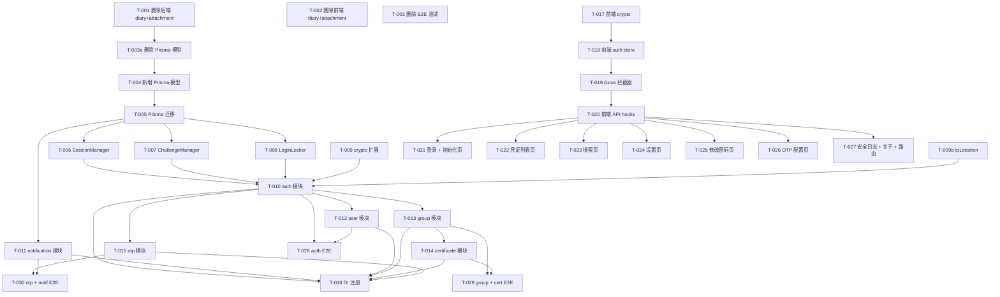

# 密码管理器迁移 - 任务清单

> **状态**: 未开始
> **设计文档**: [design.md](./design.md)
> **开始日期**: 2026-03-06

---

## 🎛️ 执行模式 (AI Agent 必读)

| 模式                | 触发词                            | 行为                         |
| ------------------- | --------------------------------- | ---------------------------- |
| **单步模式** (默认) | "开始执行"、"start"               | 执行一个任务，等待确认，重复 |
| **批量模式**        | "全部执行"、"一口气执行"、"batch" | 连续执行所有任务，最后汇报   |
| **阶段模式**        | "执行第一阶段"、"execute setup"   | 执行一个阶段的任务，然后等待 |

---

## 概览

| Phase             | Tasks  | Completed | Progress |
| ----------------- | ------ | --------- | -------- |
| Phase 1: 清理     | 4      | 0         | 0%       |
| Phase 2: 数据模型 | 2      | 0         | 0%       |
| Phase 3: 基础设施 | 5      | 0         | 0%       |
| Phase 4: 后端模块 | 7      | 0         | 0%       |
| Phase 5: 前端基础 | 4      | 0         | 0%       |
| Phase 6: 前端页面 | 7      | 0         | 0%       |
| Phase 7: E2E 测试 | 3      | 0         | 0%       |
| **Total**         | **32** | **0**     | **0%**   |

---

## Task Breakdown

### Phase 1: 清理 cube-diary 代码

- [ ] **T-001**: 删除后端 diary 模块 + attachment 模块相关代码
  - **Complexity**: Low
  - **Files**:
    - 删除 `packages/backend/src/modules/diary/`
    - 删除 `packages/backend/src/modules/attachment/`
    - 删除 `packages/backend/src/types/diary.ts`
    - 删除 `packages/backend/src/types/attachment.ts`（如存在）
    - 移除 `packages/backend/src/app/register-service.ts` 中 diary + attachment 相关代码
  - **Dependencies**: None
  - **Notes**: 保留 access-token、app-config 模块不动

- [ ] **T-002**: 删除前端 diary + attachment 相关代码
  - **Complexity**: Low
  - **Files**:
    - 删除 `packages/frontend/src/pages/diary/`
    - 删除 `packages/frontend/src/pages/attachment/`（如存在）
    - 删除 `packages/frontend/src/services/diary.ts`
    - 删除 `packages/frontend/src/services/attachment.ts`（如存在）
    - 清理 `packages/frontend/src/route.tsx` 中 diary 路由
  - **Dependencies**: None
  - **Notes**: 保留 auth、layout、store 等基础设施

- [ ] **T-003**: 删除 diary + attachment E2E 测试
  - **Complexity**: Low
  - **Files**:
    - 删除 `packages/e2e/tests/api-diary.spec.ts`
    - 删除 `packages/e2e/tests/diary.spec.ts`
    - 删除 `packages/e2e/tests/api-attachment.spec.ts`（如存在）
  - **Dependencies**: None

- [ ] **T-003a**: 删除 Prisma Diary + Attachment 模型及关联代码
  - **Complexity**: Low
  - **Files**:
    - `packages/backend/prisma/schema.prisma`（删除 Diary 和 Attachment 模型）
    - 删除 `packages/backend/storage/user-files/`、`packages/backend/storage/image-thumbs/`（attachment 存储目录）
  - **Dependencies**: T-001
  - **Notes**: 为 Phase 2 的 T-004 减少干扰

### Phase 2: 数据模型

- [ ] **T-004**: 更新 Prisma schema（新增 User/Group/Certificate/Notification）
  - **Complexity**: Medium
  - **Files**: `packages/backend/prisma/schema.prisma`
  - **Dependencies**: T-003a
  - **Notes**: 保留 AccessToken、AppConfig 模型。参考 design.md 中的 Prisma Schema 部分。

- [ ] **T-005**: 运行 Prisma 迁移生成新数据库
  - **Complexity**: Low
  - **Files**: `packages/backend/prisma/migrations/`
  - **Dependencies**: T-004
  - **Notes**: `cd packages/backend && npx prisma migrate dev --name password-manager-init`

### Phase 3: 基础设施 (Lib 层)

- [ ] **T-006**: 实现 SessionManager
  - **Complexity**: Medium
  - **Files**: `packages/backend/src/lib/session/index.ts`
  - **Dependencies**: T-005
  - **Notes**: 内存存储单一 session，30 分钟过期，支持续期、分组解锁追踪。参考旧项目 `src/server/lib/auth.ts`。

- [ ] **T-007**: 实现 ChallengeManager
  - **Complexity**: Low
  - **Files**: `packages/backend/src/lib/challenge/index.ts`
  - **Dependencies**: T-005
  - **Notes**: nanoid 生成，5 分钟过期，一次性消费。

- [ ] **T-008**: 实现 LoginLocker
  - **Complexity**: Low
  - **Files**: `packages/backend/src/lib/login-locker/index.ts`
  - **Dependencies**: T-005
  - **Notes**: 每 IP 每日最多 3 次失败。参考旧项目 `src/server/lib/LoginLocker.ts`。

- [ ] **T-009**: 扩展 crypto lib（添加 SHA512 + replay attack 验证）
  - **Complexity**: Low
  - **Files**: `packages/backend/src/lib/crypto/index.ts`
  - **Dependencies**: None
  - **Notes**: 添加 `sha512()` 和 `validateReplayAttack()` 函数。参考旧项目 `src/utils/crypto.ts`。

- [ ] **T-009a**: 实现 IpLocation（ip2region 本地离线 IP 查询）
  - **Complexity**: Medium
  - **Files**:
    - `packages/backend/src/lib/ip-location/index.ts`
    - `packages/backend/src/lib/ip-location/ip2region.ts`（移植旧项目）
    - `packages/backend/storage/ip2region.xdb`（从旧项目复制）
  - **Dependencies**: None
  - **Notes**: 移植旧项目 `src/server/lib/ip2region.ts` + `src/server/lib/queryIp.ts` + `src/utils/ipLocation.ts`。复制 `ip2region.xdb` 数据文件。

### Phase 4: 后端模块

- [ ] **T-010**: 改造 auth 模块（session 认证替代 JWT）
  - **Complexity**: High
  - **Files**:
    - `packages/backend/src/modules/auth/controller.ts`（重写）
    - `packages/backend/src/modules/auth/service.ts`（新增）
    - `packages/backend/src/modules/auth/error.ts`（更新）
    - `packages/backend/src/types/auth.ts`（新增/更新）
  - **Dependencies**: T-006, T-007, T-008, T-009, T-009a
  - **Notes**: 实现 challenge/init/login/logout/change-password 接口。移除 @fastify/jwt 依赖，改用 session preHandler hook。更新 `register-plugin.ts` 和 `register-service.ts`。init 接口需支持首次访问设置主密码流程。登录时记录 IP 地址并查询地理位置，与 commonLocation 比对生成安全通知。

- [ ] **T-011**: 实现 notification 模块
  - **Complexity**: Low
  - **Files**:
    - `packages/backend/src/modules/notification/controller.ts`
    - `packages/backend/src/modules/notification/service.ts`
    - `packages/backend/src/types/notification.ts`
  - **Dependencies**: T-005
  - **Notes**: list（分页）+ read-all + remove-all。NotificationService 需暴露 createNotice() 给 auth 模块调用。

- [ ] **T-012**: 实现 user 模块
  - **Complexity**: Low
  - **Files**:
    - `packages/backend/src/modules/user/controller.ts`
    - `packages/backend/src/modules/user/service.ts`
    - `packages/backend/src/types/user.ts`
  - **Dependencies**: T-010
  - **Notes**: set-theme + statistic + create-pwd-setting

- [ ] **T-013**: 实现 group 模块
  - **Complexity**: Medium
  - **Files**:
    - `packages/backend/src/modules/group/controller.ts`
    - `packages/backend/src/modules/group/service.ts`
    - `packages/backend/src/modules/group/error.ts`
    - `packages/backend/src/types/group.ts`
  - **Dependencies**: T-010
  - **Notes**: 含 unlock 逻辑（Password 比对 + TOTP 验证），需依赖 SessionManager。

- [ ] **T-014**: 实现 certificate 模块
  - **Complexity**: Medium
  - **Files**:
    - `packages/backend/src/modules/certificate/controller.ts`
    - `packages/backend/src/modules/certificate/service.ts`
    - `packages/backend/src/types/certificate.ts`
  - **Dependencies**: T-013
  - **Notes**: CRUD + search + sort + move。获取凭证详情时需检查分组解锁状态。

- [ ] **T-015**: 实现 otp 模块
  - **Complexity**: Medium
  - **Files**:
    - `packages/backend/src/modules/otp/controller.ts`
    - `packages/backend/src/modules/otp/service.ts`
    - `packages/backend/src/modules/otp/error.ts`
    - `packages/backend/src/types/otp.ts`
  - **Dependencies**: T-010
  - **Notes**: get-qrcode + bind + remove。使用 `otplib` 和 `qrcode` 包。

- [ ] **T-016**: 注册所有新模块到 DI 容器
  - **Complexity**: Low
  - **Files**: `packages/backend/src/app/register-service.ts`
  - **Dependencies**: T-010 ~ T-015
  - **Notes**: 创建所有 service 实例，注册所有 controller。注意依赖顺序：notificationService → authService → 其他。

### Phase 5: 前端基础设施

- [ ] **T-017**: 前端 crypto 工具（SHA512 + AES + Replay attack headers）
  - **Complexity**: Medium
  - **Files**: `packages/frontend/src/utils/crypto.ts`
  - **Dependencies**: None
  - **Notes**: 移植旧项目 `src/utils/crypto.ts`。安装 `crypto-js` 依赖。

- [ ] **T-018**: 改造前端 auth store（session token + replay secret）
  - **Complexity**: Low
  - **Files**: `packages/frontend/src/store/auth.ts`（或现有 store 文件）
  - **Dependencies**: T-017
  - **Notes**: Jotai atoms: sessionToken、replaySecret、userInfo。login/logout helpers。

- [ ] **T-019**: 改造 Axios 拦截器（session header + replay attack headers）
  - **Complexity**: Low
  - **Files**: `packages/frontend/src/services/base.ts`
  - **Dependencies**: T-017, T-018
  - **Notes**: 替换 JWT Authorization header → X-Session-Token + X-Nonce/X-Timestamp/X-Signature。

- [ ] **T-020**: 前端 API service hooks（auth、group、certificate、otp、notification、user、global）
  - **Complexity**: Medium
  - **Files**:
    - `packages/frontend/src/services/auth.ts`（改造）
    - `packages/frontend/src/services/certificate.ts`（新增）
    - `packages/frontend/src/services/group.ts`（新增）
    - `packages/frontend/src/services/otp.ts`（新增）
    - `packages/frontend/src/services/notification.ts`（新增）
    - `packages/frontend/src/services/user.ts`（新增）
    - `packages/frontend/src/services/global.ts`（新增）
  - **Dependencies**: T-019
  - **Notes**: 每个 service 文件用 TanStack Query hooks 封装对应模块 API。

### Phase 6: 前端页面

- [ ] **T-021**: 登录页 + 初始化页
  - **Complexity**: Medium
  - **Files**:
    - `packages/frontend/src/pages/login/index.tsx`（改造）
    - `packages/frontend/src/pages/init/index.tsx`（新增）
  - **Dependencies**: T-020
  - **Notes**: 登录流程：fetch challenge → SHA512(pwd + challenge) → login API。初始化：首次访问自动跳转 init 页面，引导用户设置主密码，初始化成功后跳转登录页。

- [ ] **T-022**: 凭证列表页（主页）
  - **Complexity**: High
  - **Files**:
    - `packages/frontend/src/pages/certificate-list/index.tsx`
    - `packages/frontend/src/pages/certificate-list/components/`
  - **Dependencies**: T-020
  - **Notes**: 左侧分组导航 + 右侧凭证列表。凭证详情弹窗（含 AES 解密）。分组锁定/解锁交互。

- [ ] **T-023**: 搜索页
  - **Complexity**: Low
  - **Files**: `packages/frontend/src/pages/search/index.tsx`
  - **Dependencies**: T-020
  - **Notes**: 关键字 + 颜色 + 日期范围过滤，分页结果。

- [ ] **T-024**: 设置页
  - **Complexity**: Low
  - **Files**: `packages/frontend/src/pages/setting/index.tsx`
  - **Dependencies**: T-020
  - **Notes**: 主题切换、密码生成器配置。

- [ ] **T-025**: 修改密码页
  - **Complexity**: Low
  - **Files**: `packages/frontend/src/pages/change-password/index.tsx`
  - **Dependencies**: T-020
  - **Notes**: 输入旧密码 + 新密码，调用 change-password API。

- [ ] **T-026**: OTP 配置页
  - **Complexity**: Medium
  - **Files**: `packages/frontend/src/pages/otp-config/index.tsx`
  - **Dependencies**: T-020
  - **Notes**: 显示 QR 码、绑定验证、解绑功能。

- [ ] **T-027**: 安全日志页 + 关于页 + 路由注册
  - **Complexity**: Low
  - **Files**:
    - `packages/frontend/src/pages/security-log/index.tsx`
    - `packages/frontend/src/pages/about/index.tsx`
    - `packages/frontend/src/route.tsx`（更新所有路由）
  - **Dependencies**: T-020
  - **Notes**: 通知列表（分页）+ 标记已读 + 清空。关于页显示版本信息。

### Phase 7: E2E 测试

- [ ] **T-028**: auth + user API E2E 测试
  - **Complexity**: Medium
  - **Files**:
    - `packages/e2e/tests/api-auth.spec.ts`（改造）
    - `packages/e2e/tests/api-user.spec.ts`（新增）
    - `packages/e2e/fixtures/auth.ts`（更新：session 认证流程）
  - **Dependencies**: T-010, T-012
  - **Notes**: 测试 init → challenge → login → logout → change-password，以及 user 设置接口。

- [ ] **T-029**: group + certificate API E2E 测试
  - **Complexity**: Medium
  - **Files**:
    - `packages/e2e/tests/api-group.spec.ts`（新增）
    - `packages/e2e/tests/api-certificate.spec.ts`（新增）
  - **Dependencies**: T-013, T-014
  - **Notes**: 测试分组 CRUD + 解锁 + 凭证 CRUD + 搜索 + 排序。

- [ ] **T-030**: otp + notification API E2E 测试
  - **Complexity**: Medium
  - **Files**:
    - `packages/e2e/tests/api-otp.spec.ts`（新增）
    - `packages/e2e/tests/api-notification.spec.ts`（新增）
  - **Dependencies**: T-015, T-011
  - **Notes**: 测试 TOTP 绑定流程 + 通知 CRUD。

---

## Progress Tracking

| Task   | Status | Started | Completed | Notes                        |
| ------ | ------ | ------- | --------- | ---------------------------- |
| T-001  | ⏳     |         |           | 删除后端 diary + attachment  |
| T-002  | ⏳     |         |           | 删除前端 diary + attachment  |
| T-003  | ⏳     |         |           | 删除 diary + attachment E2E  |
| T-003a | ⏳     |         |           | 删除 Diary + Attachment 模型 |
| T-004  | ⏳     |         |           | 新增 Prisma 模型             |
| T-005  | ⏳     |         |           | Prisma 迁移                  |
| T-006  | ⏳     |         |           | SessionManager               |
| T-007  | ⏳     |         |           | ChallengeManager             |
| T-008  | ⏳     |         |           | LoginLocker                  |
| T-009  | ⏳     |         |           | crypto 扩展                  |
| T-009a | ⏳     |         |           | IpLocation（ip2region）      |
| T-010  | ⏳     |         |           | auth 模块改造                |
| T-011  | ⏳     |         |           | notification 模块            |
| T-012  | ⏳     |         |           | user 模块                    |
| T-013  | ⏳     |         |           | group 模块                   |
| T-014  | ⏳     |         |           | certificate 模块             |
| T-015  | ⏳     |         |           | otp 模块                     |
| T-016  | ⏳     |         |           | DI 注册                      |
| T-017  | ⏳     |         |           | 前端 crypto                  |
| T-018  | ⏳     |         |           | 前端 auth store              |
| T-019  | ⏳     |         |           | Axios 拦截器                 |
| T-020  | ⏳     |         |           | 前端 API hooks               |
| T-021  | ⏳     |         |           | 登录 + 初始化页              |
| T-022  | ⏳     |         |           | 凭证列表页                   |
| T-023  | ⏳     |         |           | 搜索页                       |
| T-024  | ⏳     |         |           | 设置页                       |
| T-025  | ⏳     |         |           | 修改密码页                   |
| T-026  | ⏳     |         |           | OTP 配置页                   |
| T-027  | ⏳     |         |           | 安全日志 + 关于 + 路由       |
| T-028  | ⏳     |         |           | auth E2E 测试                |
| T-029  | ⏳     |         |           | group + cert E2E             |
| T-030  | ⏳     |         |           | otp + notif E2E              |

**Legend**: ⏳ Pending | 🔄 In Progress | ✅ Done | ❌ Blocked | ⏸️ On Hold

---

## Dependency Graph

